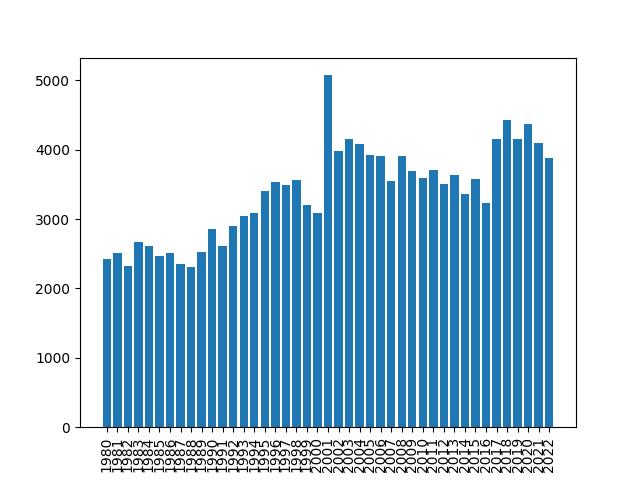

# UniqueWordsInSongs
This is a quick scripting project that answers the question: "Are there more unique words in songs now-a-days compared to ye olden times (1980)?" Another way of wording this question is, "Has the broadness of vocabulary in popular music deepened or dwindled in the last few decades?"
My conclusion after this scrappy and poorly constructed project is that the opposite is happening. Broadly, the breadth of vocabulary used in the top 100 songs has steadily increased from 1980 to 2022. Oddly, the year with the largest vocabulary was 2001. 
Here is a graph I created. 

It would be interesting to control for other variables in this analysis, like length of song. A 2 minute song will likely have a more restricted vocabulary than a 5 minute song, simply because a 2 minute song contains fewer words. If I ever revisit this project (not likely), I would take a look at the frequency of unique words as compared to the frequency of repeat words in individual songs.